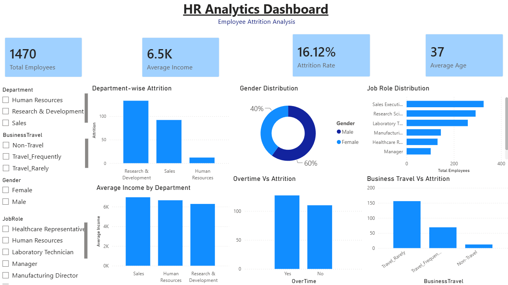
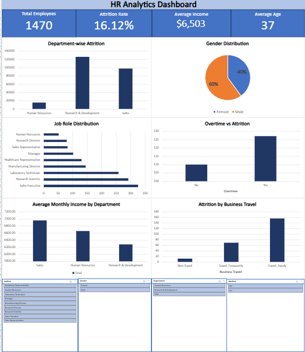
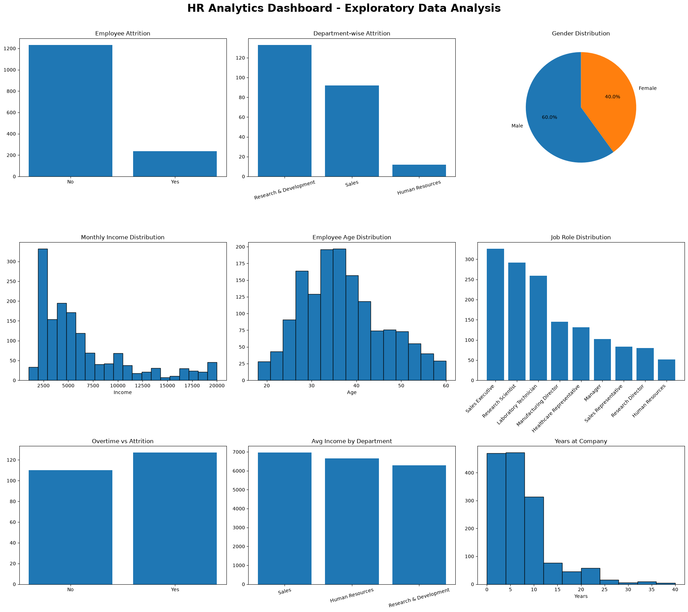

# 👥 HR Analytics Employee Attrition Analysis

## 📌 Project Overview

This project is an end-to-end HR Analytics solution built using **SQL, Python, Excel, and Power BI**. The objective was to analyze employee attrition, identify workforce trends, and develop interactive dashboards that support data-driven HR decision-making.

The project follows a complete analytics workflow—from data exploration and cleaning to business analysis and dashboard development.

---

# 🎯 Executive Summary

### Business Problem

Employee attrition is a critical HR challenge that increases recruitment costs, reduces productivity, and impacts organizational performance. This project analyzes employee data to identify key drivers of attrition and provide actionable recommendations for improving employee retention.

### Key Insights

- Overall employee attrition rate is **16.12%**.
- Research & Development has the highest employee turnover.
- Employees working overtime experience significantly higher attrition.
- Sales Executives, Research Scientists, and Laboratory Technicians represent the largest workforce segments.
- The Sales department has the highest average monthly income.

### Business Recommendations

- Review overtime policies to improve employee work-life balance.
- Prioritize retention initiatives in departments with high attrition.
- Improve employee engagement and career development programs.
- Continuously monitor workforce metrics using interactive dashboards.

### Business Impact

This analysis helps HR teams identify high-risk employee groups, monitor workforce trends, and make informed decisions to improve retention and workforce planning.

---

# 🏗️ Project Architecture

```text
Raw HR Dataset (CSV)
          ↓
SQL Business Analysis
          ↓
Python Data Cleaning & EDA
          ↓
Excel Dashboard
          ↓
Power BI Dashboard
          ↓
Business Insights & Recommendations
```

---

## 🎯 Business Objectives

- Analyze employee demographics and workforce distribution.
- Measure overall employee attrition.
- Identify departments and job roles with the highest attrition.
- Analyze the relationship between overtime and employee turnover.
- Compare average monthly income across departments.
- Build interactive dashboards for HR stakeholders.

---

## 🛠️ Tools & Technologies

- SQL (MySQL)
- Python (Pandas, Matplotlib)
- Microsoft Excel
- Power BI
- DAX
- Git & GitHub

---

## 📂 Dataset

**Dataset:** IBM HR Analytics Employee Attrition Dataset

**Records:** 1,470 Employees

The dataset includes:

- Employee Demographics
- Department
- Job Role
- Monthly Income
- Overtime
- Business Travel
- Attrition
- Performance
- Experience

---

# 📚 Business Metrics Dictionary

| Metric | Formula | Business Meaning |
|---------|----------|------------------|
| Attrition Rate | Employees Left ÷ Total Employees × 100 | Measures employee turnover |
| Retention Rate | 100 − Attrition Rate | Measures workforce retention |
| Average Monthly Income | Average(MonthlyIncome) | Employee compensation level |
| Average Age | Average(Age) | Workforce demographic profile |
| Employees Left | Count of Attrition = "Yes" | Total employees who resigned |

---

# 🧹 Data Cleaning Summary

| Issue | Action Taken |
|-------|--------------|
| Missing Values | Verified dataset for missing values |
| Duplicate Records | Checked EmployeeNumber for duplicate employees |
| Constant Columns | Identified EmployeeCount, StandardHours, and Over18 as constant fields |
| Data Types | Verified numeric and categorical columns before analysis |
| Data Validation | Confirmed data consistency prior to SQL and Python analysis |

---

## 🔄 Project Workflow

```text
Raw Data (CSV)
        ↓
SQL Analysis
        ↓
Python Exploratory Data Analysis (EDA)
        ↓
Excel Dashboard
        ↓
Power BI Dashboard
        ↓
Business Insights & Recommendations
```

---

# 📊 SQL Analysis

Business-oriented SQL queries were developed to answer key HR questions including:

- Data Quality Assessment
- Employee Overview
- Attrition Analysis
- Salary Analysis
- Department Analysis
- Overtime Analysis
- Advanced SQL Analysis using Aggregate Functions and Subqueries

Each query focuses on solving a practical HR business problem and generating actionable insights.

---

# 🐍 Python Analysis

Python was used for data exploration and visualization using **Pandas** and **Matplotlib**.

The notebook includes:

- Data Exploration
- Data Cleaning
- Exploratory Data Analysis (EDA)
- Attrition Analysis
- Salary Analysis
- Correlation Analysis
- Business Visualizations
- Business Insights

---

## 📈 Excel Dashboard

The Excel dashboard includes:

- KPI Cards
- Pivot Tables
- Pivot Charts
- Interactive Slicers
- Department Analysis
- Job Role Distribution
- Gender Distribution
- Business Travel Analysis

---

## 📉 Power BI Dashboard

The Power BI dashboard was developed using DAX measures and interactive visuals.

Key features include:

- KPI Cards
- Attrition Dashboard
- Department-wise Analysis
- Overtime Analysis
- Business Travel Analysis
- Interactive Slicers
- Dynamic Filtering
- DAX Measures

---

# 📊 Key Business Insights

- The organization has **1,470 employees** with an overall **attrition rate of 16.12%**.
- Research & Development recorded the highest employee attrition.
- Employees working overtime show higher turnover compared to employees without overtime.
- Sales Executives, Research Scientists, and Laboratory Technicians represent the largest workforce groups.
- The Sales department has the highest average monthly income.
- Frequent business travel is associated with increased employee attrition.

---

# 🚀 Business Recommendations

- Develop retention programs for high-attrition departments.
- Reduce excessive overtime to improve employee satisfaction.
- Monitor workforce metrics regularly using HR dashboards.
- Review compensation strategies for critical job roles.
- Strengthen employee engagement initiatives.

---

## 📸 Dashboard Screenshots

### Power BI Dashboard



---

### Excel Dashboard



---

### Python EDA Dashboard



---

## 🚀 Skills Demonstrated

### SQL

- Aggregate Functions
- CASE Statements
- GROUP BY & HAVING
- Subqueries
- Data Quality Assessment
- Business-Oriented SQL Analysis

### Python

- Data Cleaning
- Exploratory Data Analysis (EDA)
- Data Visualization
- Correlation Analysis
- Business Insights

### Excel

- Pivot Tables
- Pivot Charts
- KPI Cards
- Slicers
- Dashboard Design

### Power BI

- Power Query
- DAX Measures
- Interactive Dashboards
- KPI Cards
- Data Modeling

### Business Analysis

- Employee Attrition Analysis
- Department Analysis
- Salary Analysis
- Workforce Analytics
- Dashboard Development

---

# ⭐ Interview Story (STAR Format)

### Situation

The HR department needed to understand the factors contributing to employee attrition and improve workforce retention.

### Task

Analyze employee data to identify attrition patterns, build interactive dashboards, and provide business recommendations.

### Action

- Performed SQL-based business analysis.
- Conducted exploratory data analysis using Python.
- Built interactive dashboards in Excel and Power BI.
- Identified workforce trends related to departments, overtime, salary, and business travel.

### Result

The analysis highlighted key attrition drivers and produced interactive dashboards that enable HR stakeholders to monitor workforce metrics and support data-driven retention strategies.

---

# 🔮 Limitations & Next Steps

### Current Limitations

- Dataset represents a single organization.
- Historical data only; no real-time employee records.
- Employee engagement survey data was not available.

### Next Steps

- Develop a predictive employee attrition model.
- Include employee satisfaction and engagement survey data.
- Build automated HR dashboards using live data sources.

---

# 📌 Conclusion

This project demonstrates my ability to transform HR data into meaningful business insights using SQL, Python, Excel, and Power BI. It showcases the complete analytics workflow—from data preparation and exploratory analysis to interactive dashboard development and business storytelling.

---

## 📬 Author

**Sameer Sharma**

Aspiring Data Analyst

If you found this project helpful, feel free to ⭐ the repository.
